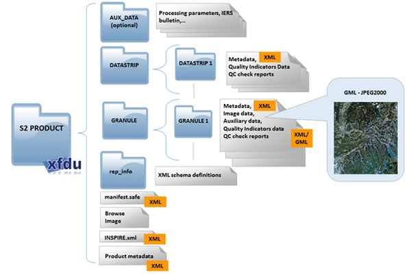
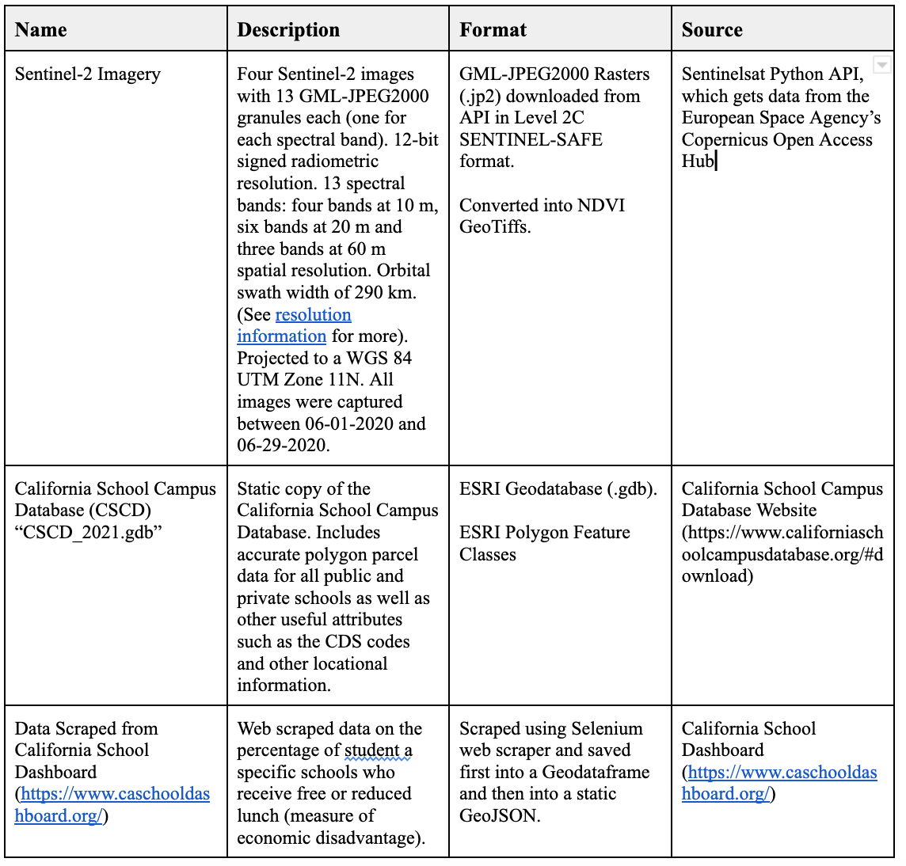
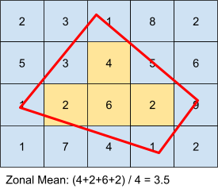
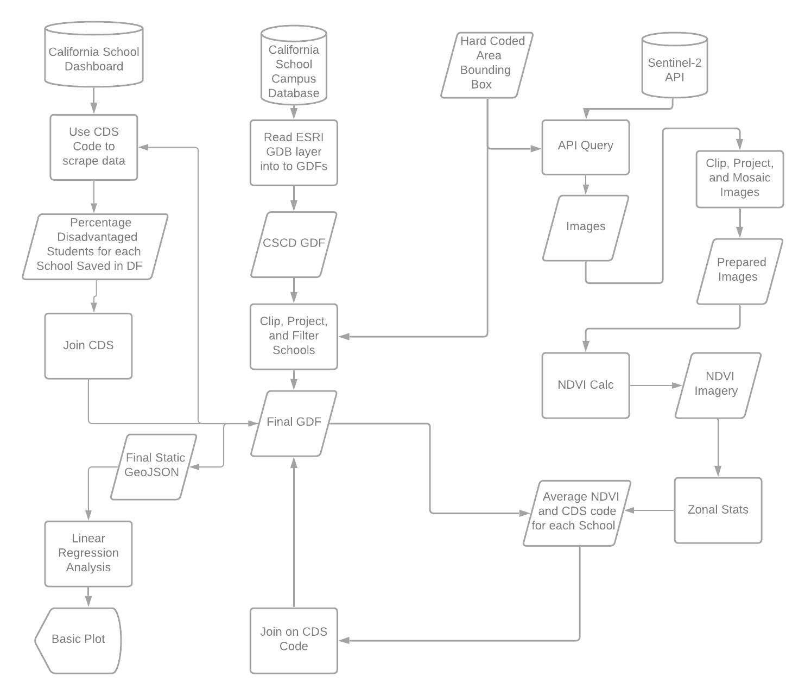
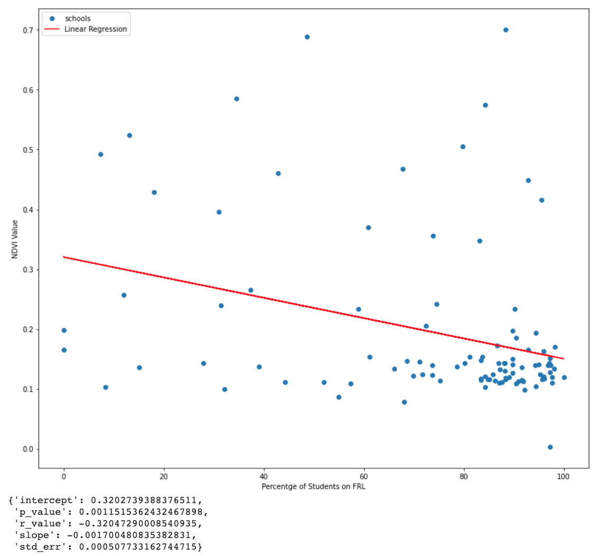
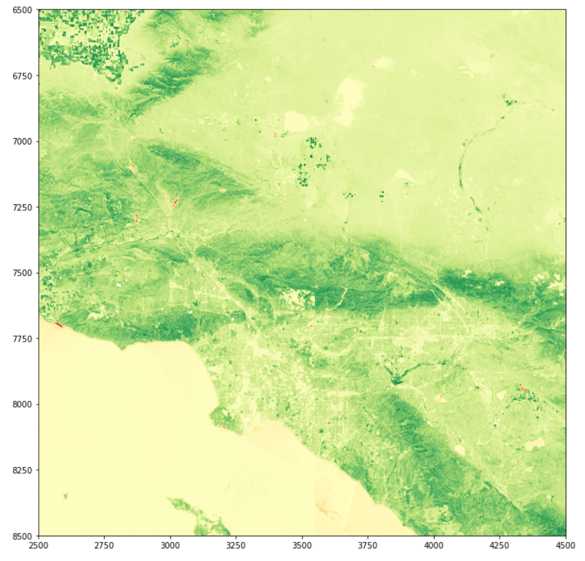

**Investigating the Relationship Between School Campus Greenery and Economic Disadvantage Using Open-Source Geospatial Python Libraries**

#### Introduction/Motivation

The project performs a basic linear regression analysis vegetative greenery of public school campuses in the LA Area and the percentage of students at each school who receive free or reduced pricing for lunches (a metric of the economic disadvantage of the students at a school). The thought is, that the more money a school has access to, based on donations and support from parents/families plus the regular state funding, the more investment there will be in greening a campus. There is also a well established body of research documenting the significant but somewhat tenuous link between school campus greenery and academic performance (Kwong et al. 2017) (Akinpar, 2016) (Leung el al. 2019)(Hodson, 2017). I also know that there are studies that have attempted to reinforce this link using remote sensing data and other GIS tools (Wu et al., 2014) . I wanted to see if I could find a similar relationship in the LA area using only open-source data and geospatial Python libraries. Though I did find a weak relationship between the stated variables, the project was mostly concerned with the overall workflow and the feasibility of using open-source tools for such an analysis. There are a number of other concerns with the geospatial analysis that could inhibit any valid conclusions being drawn. This document will serve as a more comprehensive explanation of the methods and data involved in the project. For an abbreviated explanation of how to use the script, please refer to the README.md document contained in the [repository](https://github.com/areeseb/GreenSchools). 

#### Data and Data Processing

The project has three data sources:

1. Sentinel-2 satellite imagery
2. California School Campus Database
3. Web scraped data on the percentage of “economically disadvantaged” at each school

The Sentinel-2 imagery was downloaded from European Space Agency's Copernicus "sentinelsat" Python API. The script first queries the API and saves the query results into a GeoPandas Geodataframe (GDF). It then uses the GDF to filter the results and download the specific non-overlapping images of the study area. Bands 4 (red) and 8 (NIR) are used to derive NDVI images that are saved as GeoTiffs. The imagery is provided in a specific file format known as SENTINEL-SAFE, which is designed by ESA Earth Observation archiving department in order to facilitate data integrity and integration with data from other Sentinel platforms. It includes both the imagery as well as Metadata. My script is designed to navigate the folder structure to extract the images. See Figure 2 for SENTINEL-SAFE format:

_Figure 2. SENTINEL-SAFE File Format Source: [link](https://sentinel.esa.int/web/sentinel/user-guides/sentinel-2-msi/data-formats)_

The California School Campus Database (CDCD), which is developed and distributed by the Stanford Prevention Research Center and the GreenInfo Network, contains accurate geotagged school campus polygons as well as other basic school information such as CDS codes, address, enrollment, and district info. I downloaded the database as a static ESRI Geodatabase, which is read into a GeoPandas Geodataframe for processing and display. 
The web scraped data is acquired from the California School Dashboard (https://www.caschooldashboard.org/) using the Selenium web scraper. It scrapes data on the percentage of students at each school who received free or reduced lunch. This is a classic metric in the world of education research to indicate the socioeconomic demographic of a school or the percentage of economically disadvantaged students. The data is scraped using a list of unique CSD codes (ID) for each school that is compiled from schools in the California School Campus Database (CDCD). The default version of the script scrapes 100 randomly selected schools and joins the data back into the master GeoPandas Geodataframe containing the filtered CSCD. All the data is then saved into a static GeoJSON that can be called up on request by selecting a static representation of the data in the script. 

#### Methods

The script used a few primary Python libraries: GeoPandas, Rasterio, Rasterstats, Fiona, and SciPy. GeoPandas is an extension to the common Pandas library but with support for geospatial data (geometry). Rasterio is a Numpy backed library that supports imagery (raster) analysis and visualization. Rasterstats is a small library for calculating zonal statistics (see figure 3) .  Fiona is a backend library that supports the projection/transformation between coordinate systems in geospatial data. SciPy is a large scientific scripting library but for the project, I just used the linear regression portion of the stats module. 

The specific workflow of the script can be divided into 3 different sections. An overview of the entire script can be seen in the workflow in figure 4.The first section is to acquire and prepare the Sentinel-2 imagery. This involves querying the API based on a few filtering parameters such as the tolerance for cloud coverage, imagery type, search bounding box. The query results are then read into a Geopandas Geodataframe (GDF), which contains information about each image. The geodataframe was then trimmed down to only a few select images, needed for analysis. The images are downloaded from the API in a zipped Sentinel-SAFE format. I then traverse the .SAFE folders unzip the specific images needed to create the NDVI image. NDVI is a common spectral band ratio used in imagery analysis. It provides a value for each pixel from -1 to +1 that represents approximately how much healthy greenery is in every pixel. A rainforest would be around 1 and a slab of concrete would be around 0. Negative numbers are usually representative of shadows or open water. It is based on the red and near infrared spectra reflected from the surface. Spectral bands band 4 and 5 (red and near infrared) are extracted from the Sentinel-2 images and read into Rasterio objects (which are essentially just numpy arrays tuned for raster data). The NDVI is calculated using matrix algebra on the two different Rasterio arrays. The code for this calculation can be seen calculation can be seen below:

    ((nir.astype(float) - red.astype(float)) / (nir + red))

The resulting NDVI Rasterio object is then written to a drive as a GeoTiff and appropriately projected and prepped with metadata. 

The next section of the code repares the California School Campus Database (CSCD). This section is fairly simple. It involves first opening a specific Feature Class from the database, which includes the public school campus boundaries, as a Geopandas Geodataframe  (GDF). The GDF is then clipped to the extent of the imagery and projected to the appropriate projection (WGS84 UTM Zone 11N). A few unnecessary attributes (columns) are also dropped from the dataframe to reduce size. This GDF serves as the platform for the rest of the analyses and is used to store all the final data. 

The next section involves calculating the average zonal NDVI values for each of the schools in the prepared CSCD GDF. To do this, I used a library called Rasterstats, which essentially rasterizes polygons (school boundaries) and calculates various zonal statistics. See figure 3 for an example of calculating zonal mean. The figure displays what is happening for every school campus in the database based on NDVI values for each raster cell. The output of the calculation is a GeoJSON containing the zonal stats, which is then immediately read into a Geodataframe (GDF). This GDF is then merged back into the CSCD GDF, so that each school also includes information about average NDVI values. 

_Figure 3: Zonal Mean Calculation_

The final data acquisition/preparation involves scraping the California School Dashboard for the percentage of economically disadvantaged students at each school. Since, the website is loaded dynamically, I couldn’t use a regular static scraper such as BeautifulSoup or urllib3. I selected to use Selenium as an alternative, which supports dynamic scraping via a headless browser. Since scraping each data point can take up to 2 seconds with Selenium, rather than scraping data for all schools in the filtered CSCD (~3000 schools), I take a sample of schools from the CSCD and scrape data from those schools. To do this, I randomly sample 100 unique schools from the CSCD GDF and create a list of CDC codes for these schools. The CDS code is a unique ID given to every school in California and is conveniently part of the URL for each school in the California School Dashboard. Once the data is scraped, it is then merged back into the existing CSCD dataframe, which now includes the scraped metric and the average NDVI values. 

The final part of the scripts runs the regression analysis. Initially I was going to perform just a simple Pearson-r correlation analysis but there was something deeply unsatisfying about writing a whole interesting script only to spit out a simple r-value. The regression analysis is at least visualizable, and also provides an r-value. For this, I used SciPy’s linear regression tool. It takes two lists as inputs, one for x values and one for y values. My x values (independent variable) are the percentages of economically disadvantaged students for the 100 sample schools, and the corresponding y values (dependent variable) are the average NDVI values at each school. The output is a list containing the slope, intercept, r-value, p-value, and standard error of the regression model. I use these values to visualize the model in a simple scatter plot. I wasn’t necessarily concerned with the scientific validity of the results, as the whole workflow is essentially just a framework outlining the potential for similar, more scientifically sound, analyses.

_Figure 4: Diagram of Code Logic/Workflow_

#### Conclusion

I found a very weak negative correlation between the greenness of a school campus and the percent of economically disadvantaged students. With an r-value of  approximately -0.3, this is far too weak to draw any serious scientific conclusions and there are a number of issues with the study geospatial analysis portion of the study. However, the goal of the project was not to provide a perfectly valid scientific answer to my inquiry but rather to investigate the potential for similar projects using open-source tools and practice the collection and processing of data in Python. In this regard my project was successful. The outputs can be seen in figure 5 and 6 below. Note that there is a large cluster of schools that are both low in NDVI and high in the percentage of economically disadvantaged students. This distribution is simply due to the general characteristic of schools in California and the fact that I took a random sampling of schools. In the future, it would be interesting to control for the independent variable by including a uniform sample distribution of economic disadvantage in sampled schools. 

_Figure 5: Linear Regression Model_

_Figure 6: NDVI Imagery Visualization_

## References

Akpinar, Abdullah . “How is high school greenness related to students’ restoration and health?”
Urban Forestry & Urban Greening. Volume 16,
(2016): 1-8. (https://www.sciencedirect.com/science/article/pii/S1618866716000078).

Kweon, Byoung-Suk, Christopher D. Ellis, Junga Lee, Kim Jacobs. “The link between school environments and student academic performance.” Urban Forestry & Urban Greening, Volume 23,
(2017): 35-43. (https://www.sciencedirect.com/science/article/pii/S1618866716300140).

Leung, Wing Tuen Veronica, Tuen Yee Tiffany Tam, Wen-Chi Pan, Chih-Da Wu, Shih-Chun Candice Lung, John D. Spengler. “How is environmental greenness related to students' academic performance in English and Mathematics?” Landscape and Urban Planning. Volume 181, (2019): 118-124,
(https://www.sciencedirect.com/science/article/pii/S0169204618310569).

Hodson, Cody B., Heather A. Sander. “Green urban landscapes and school-level academic performance.”
Landscape and Urban Planning. Volume 160 (2017): 16-27. (https://www.sciencedirect.com/science/article/pii/S0169204616302651).

Wu, CD, McNeely E, Cedeño-Laurent JG, Pan WC, Adamkiewicz G, et al. “Linking Student Performance in Massachusetts Elementary Schools with the “Greenness” of School Surroundings Using Remote Sensing.” PLOS ONE (2014): e108548. (https://doi.org/10.1371/journal.pone.0108548).

