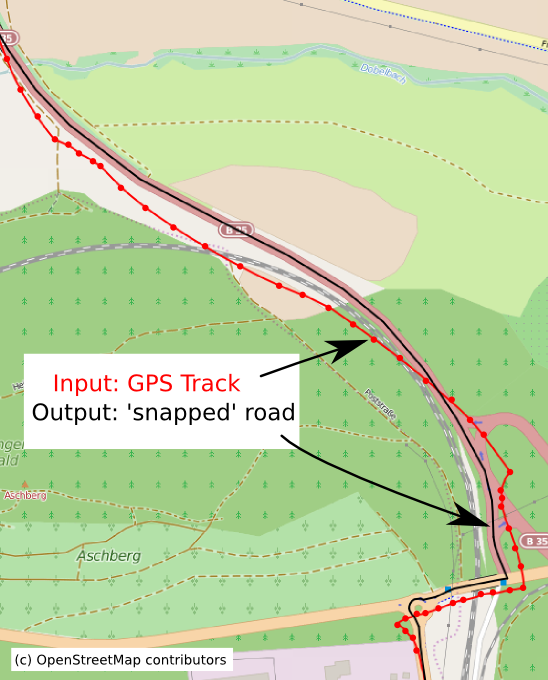
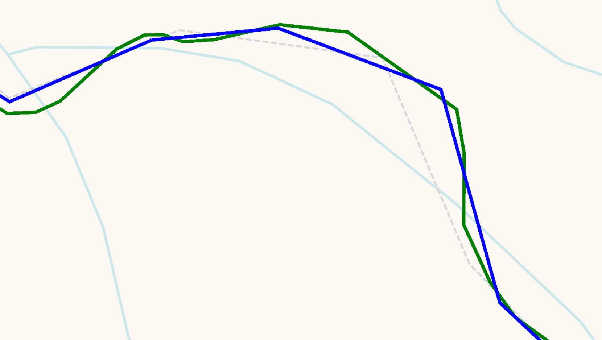
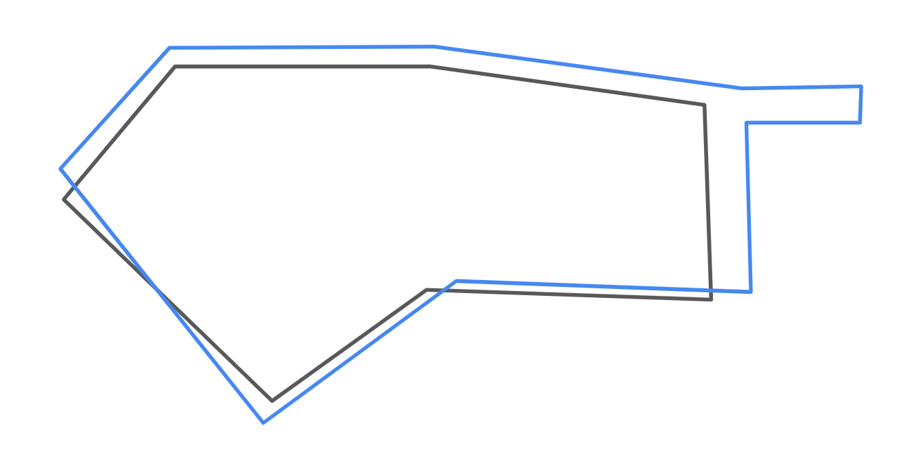
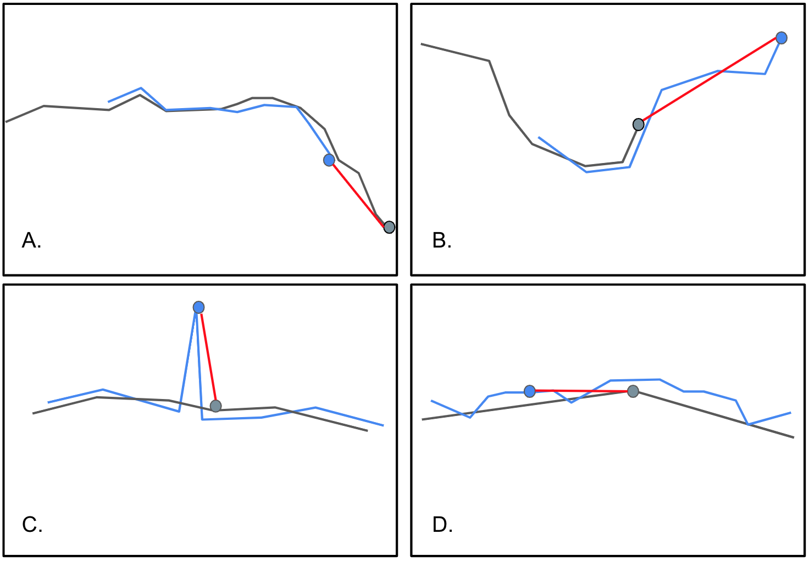
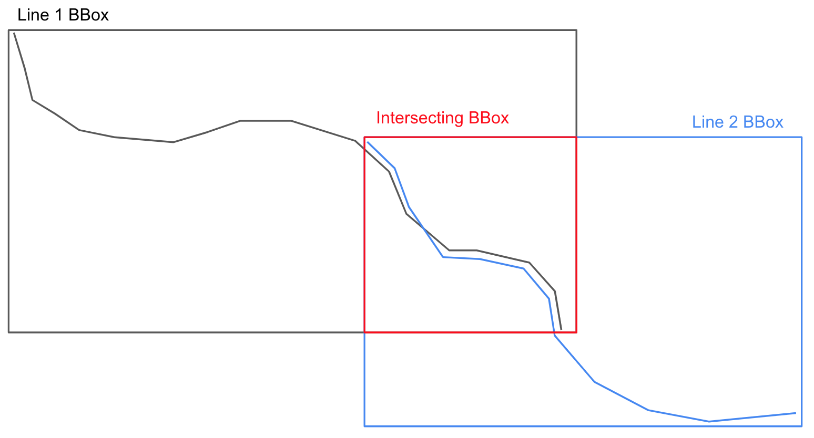

**Map Matching Polylines and Polygons Using Geometric Heuristic Algorithms**

This little blog post will provide a explanation and summary of some preliminary work I have been doing on implementing a map matching algorithm for varied (spatial) vector data. I am fairly early in the process and by no means have an excellent solution, I just want to share some of my thinking in the hope that it might help other people in my situation and clarify some of my own thinking.

### Background
___

Map Matching is a common problem in the spatial sciences that involves relating one set of geometry to another reference set. Most commonly this takes the form of associating a GPS trace with a reference road network. However, many others variations to the problem exist (sometimes with different names), for example, deriving a reference polyline from a set of different GPS traces, matching and merging separate polygon datasets, or even matching extracted feature polygons (buildings) from remote sensing imagery.

Figure 1.

_By OpenStreetMap and contributors - openstreetmap.org, CC BY-SA 2.0_

Map Matching is very much an open problem and the appropriate solutions are dictated by on a number of factors such as data format/quality/scale, computational resources, and temporal constraints (realtime/static).

The majority of approaches can be divided into very broad categories:

* **Geometric Solutions**

    Geometric solutions typically relate features based on using a geometric similarity metric (e.g. the distances points in a GPS trace to a reference road). Geometric methods are often used when the input format is varied or doesn't conform to the traditional GPS trace/network configuration.

* **Hidden Markov Models**

    Hidden Markov Models are often used for the GPS trace/road network format. In this case, the sequence of points in a GPS trace are the observations and road segments in the network are the hidden states. The matched series of road segments in the network is the set of states with the most likely transitions (series of road segments) based on the observations (gps trace).

For a few good examples of modern map matching see:

:   Saki, S., Hagen, T. A Practical Guide to an Open-Source Map-Matching Approach for Big GPS Data. SN COMPUT. SCI. 3, 415 (2022). https://doi.org/10.1007/s42979-022-01340-5

:   Map Matching at Uber.  
https://www.youtube.com/watch?v=ChtumoDfZXI

:   Douriez, Marie. A New Real-Time Map-Matching Algorithm at Lyft. https://eng.lyft.com/a-new-real-time-map-matching-algorithm-at-lyft-da593ab7b006

I elected to explore **geometric solutions** for a few reasons:

* Less sensitive to input data format and quality (i.e. I don't have a reference network to work off of)
* Computational cost is less of an issue given that I am working off with (relatively) small data sets.
* I am working by myself and don't have the time resources to implement novel HMMs in a computationally effective manner. Additionally many common geospatial packages in Python already have geometric metrics implemented.

The two common traditional geometric similarity measures for curves/lines that are readily available in Python are **Hausdorff** and **Frechet** distance.

**Hausdorff Distance** is defined intuitively as the greatest of all distances from a point in one set, to it's closest point in another set.

The mathematical definition is roughly,

_Let P and Q be two point sets in some metric space._

_The directed Hausdorff distance from P to Q, denoted by_ $h(P, Q)$ _, is the_ $max$ $p∈P$ $min$ $q∈Q$ $|p − q|$.

_(In other words, the max distance from a point in P to it's closest point in Q)_

_The Hausdorff distance between P and Q, is the symmetric max_ ${h(P, Q), h(Q, P)}$.

_(i.e the maximum of all distances for a point in one set to the closest point in another)_

Hausdorff distance has many applications but is often used in the spatial sciences to compare similarity of polygons.

In my case, the Hausdorff distance between two polylines, would be the max distance one can travel between vertices in one line, to the closest vertex in another line. So if two polylines represent the same road/trail on the ground, they should have a small Hausdorff distance.

Here's a kinda silly [video](https://www.youtube.com/watch?v=R7WZFTnir_k) showing an optimized Hausdorff distance being used to compare 3D renderings of animals.

**Frechet Distance** has some similarity to Hausdorff distance but instead, it takes the order of points into account. This makes it often more apt for comparing the similarity of polylines.

One common way to understand Frechet distance is to imagine two separate paths (polylines), with a person on one path, and a dog on the other. The person and dog are connected via a leash, and can walk forward on their respective paths but not backward. They can also walk at any speed they desire and the leash can stretch to any arbitrary distance. The Frechet distance is the minimum length of leash that can be used for the dog and person to walk their paths.

The mathematical definition of Frechet distance is a bit more complex but for those interested, here is a great [video](https://www.youtube.com/watch?v=TJeeZFNXi9M&t=139s) explaining both the intuitive and the mathematical definition:

### Problem

___

My specific problem is to ingest and integrate medium (~100k features) polyline and polygon datasets into an existing database with significant spatial overlap. This means that features in input data that represent the same object on the ground as a feature in the reference data set need to be dropped or merged.

The main issue is that quality of input data is very suspect. There is essentially no guarantee of any shared attribute data or identical geometry. Additionally, the reference data set is not a proper network. There is no topology and no other features typical of networked data (i.e. direction, junctions/nodes, elevation, etc). All there is to go off is the similarity of the geometry.

I should also note that I need to complete a similar task for both polylines and polygons.

Given these constraints, the best I can hope for is a kind of filter that can find the obvious cases of where input an polyline or polygon is identical or very similar to the reference data. Once I get the obvious cases, the rest of the close(ish) matches and be identified and corrected manually.

Here's an example of two polylines that'd need to be merged or dropped:

Figure 2.

Here's an example of two polygons that'd need to be merged or dropped:

Figure 3.

### Solution

I'll use Python to both explain and demonstrate some of the methods I've explored. For privacy (to my employer) and readability (for you all), I'll only show "pseudo-codey" solutions. Note that in a production setting, a lot of the code gets and cleaned up and optimized a bit. Also note that for brevity, I'll only show the implementation for polyline comparisons. Polygon comparisons are similar but require some alterations.

The very basic "brute force" approach would just be to calculate the Frechet/Hausdorff distance between every input polyline/polygon and all the reference polylines/polygons. Then, a threshold could be chosen for each distance metric and polylines/polygons that are below the threshold, are assumed matches.

The first issue with this solution is that it's generally a very bad idea to compare every feature in input data set to every other feature in the reference other dataset $O(n^2)$ :grimacing:. Most input features will have at most one other match and all others will be quite far apart (spatially).

Fortunately there's a simple two solutions to this:

* Only compare each input feature to nearby reference features by using a spatial index to run intersections

With this simple optimization, here's a sketch of the basic approach:

~~~ Python
import geopandas as gpd
import pandas as pd
import defaultdict
from shapely import LineString
from shapely import hausdorff_distance
from shapely import frechet_distance

#read input data from file
input_gdf = gpd.read_file('path_to_input_data')
input_gdf = input_gdf.set_index('id')

#get reference data out of database
reference_gdf = gpd.from_postgis('SELECT id, geom FROM reference_table')
reference_gdf = reference_gdf.set_index('id')

#make a place to store the results
results_dict = defaultdict(list)

#build a (R-tree) spatial index for reference data
reference_sindex = reference_gdf.sindex 

# loop over all the input features
for input_index, input_feature in input_gdf.iterrows(): 

    input_geom = input_feature['geom']

    #use the spatial index to get intersecting reference features   
    possible_matches = list(reference_sindex.query(input_geom, predicate='intersects')) #use the spatial index to get intersecting reference features

    #loop over possible matches
    for i in possible_matches:

        #extract index/geom from possible reference matches
        reference_index = reference_gdf.index[i]
        reference_geom = input_gdf.geometry.iloc[i]

        #calculate geometric distance metrics
        hausdorff = hausdorff_distance(input_geom, reference_geom)
        frechet = frechet_distance(input_geom, reference_geom) 

        #save results for later use
        results_dict['input_index'].append(input_index)
        results_dict['reference_index'].append(reference_index)
        results_dict['input_geom'].append(input_geom)
        results_dict['reference_geom'].append(reference_geom)
        results_dict['hausdorff_distance'].append(hausdorff)
        results_dict['frechet_distance'].append(fechet)

#make a dataframe out of the results to make processing easier
results_df = pd.DataFrame(results_dict)

~~~

Unfortunately, this clean little solution still has major problems that mostly have to do with the distances metrics themselves:

1. **Alignment Issues:** Both metrics are highly sensitive to outlier points and misaligned features, where points in one feature deviate significantly from the matching feature. Below are a few examples to illustrate the issue:

Figure 4.

2. **Computationally Intensive:** Calculating both distance metrics involves comparing each point in one feature to all points in the other feature. This gets even more expensive in cases like D. (above) where the reference polyline would needs to be "densified" (creating a series of temporary points along the segment to aid in comparison).

3. **Ambiguity with Multiple Closest Points:** In some scenarios, a point in an input feature may be (almost) equidistant to multiple reference features, causing ambiguity or at the very least poor distance measurement. 

4. **Dependency on Threshold Selection:** Both metrics requires setting a distance threshold to determine which features are considered matching. Determining a threshold to work for all cases is complex and can be very subjective. 

5. **Limited to Polylines:** Though Hausdorff distance can be used on polygons, Frechet distance is almost useless on complex polygons because of the emphasis on order

The brunt of my work has been mostly trying to address (1) and to some degree (3) and (5). (4) is something that I am actively working on and I may explain more about in a further post.

I've had two main breakthroughs:

1. Incorporating the PoLiS distance metric
2. Trimming geometry before comparison

#### Polis Metric

While surfing the web for solutions to similar problems with polygon map matching, I stumbled upon an interesting [paper](https://elib.dlr.de/90425/1/avbelj_GRSL_00093_2014_final_submitted.pdf) that devised a new simple metric for comparing extracted polygons from remote sensing imagery to reference polygons. They call their method the PoliS metric (**Po**lygon **Li**ne **S**egment).

* _Avbelj, Janja, et al. “A Metric for Polygon Comparison and Building Extraction Evaluation.” IEEE Geoscience and Remote Sensing Letters, vol. 12, no. 1, Jan. 2015, pp. 170-174, 6. Accessed 2 Aug. 2023._

The PoLiS metric is intuitively defined as the symmetric mean of the distances between each point/vertex in one polygon and it's closest point (not necessarily a vertex) in the other polygon.

More formally,

Let $A$ and $B$ denote point sets representing closed polygons. Then, the points $a_j , j = 1, . . . , q$ represent the vertices of the closed polygon A, where the first and the last vertex coincide $a_1 = a_q+1, j = 1, . . . , q + 1$. Likewise, the point set for closed polygon B, is denoted as $k = 1, . . . , r+1$ vertices. A boundary is denoted as $∂A$ which consists of $q+1$ vertices $a_j$ of the closed polygon $A$, $q$ edges, and points that lie on the boundary. Any point, (e.g. $a ∈ A$), without a subscript can be either a vertex or a point on a line segment without explicitly defined coordinates.

So the symmetric PoLiS metric is defined as,

$P(A, B) =  \frac{1}{2q}\sum_{a_j∈A} \min_{b∈∂B}||a_j - b || + \frac{1}{2r} \sum_{b_k∈B} \min_{a∈∂A} ||b_k - a ||$

The advantage of the PoLiS metric is that it performs better with some of the alignment issues illustrated in figure 4, such as A and D. In these cases the difference is that it calculates the distance not only from vertex-to-vertex but from vertices in on feature to the nearest point in the other feature, regardless if it's a vertex or point along one of the edges.

Additionally, the PoLiS metric is less sensitive to small changes in translation and rotation, which can be common when geographic data isn't handled carefully.

The elephant in the room is that the PoLiS metric is formally defined for polygon comparison and in my case I am primarily (but not exclusively) working with polylines.

This turns out not to be much of a problem. First off, it's actually quite convenient that it works for polygons, because even an adapted Frechet distance doesn't perform well on real work geographic data due to it's emphasis on the order of points. Secondly, the PoLiS metric is quite easily adapted to work with polylines. The only change is that the point/vertices that define each feature set (A, B) needn't be closed. In other words, the first point in a set doesn't have to also be the last.

There are various implementations of the PoLiS metric that can be found [online](https://github.com/spgriffin/polis) but for the sake of learning the method and adapting it to work with polylines, I chose to implement it myself instead of using existing packages.

~~~ Python
def line_polis_metric(line_1, line_2):
    """
    Calculates the PoLiS metric for two Shapely LineString objects
    :params 
        line_1: first LineString object
        line_2: second LineString object
    :return
        Symmetric PoLiS metric
    """
    line_1_sum = 0.0
    for vertex in line_1.coords:
        point = Point(vertex)
        line_1_sum += line_2.distance(point)
        
    line_2_sum = 0.0
    for vertex in line_2.coords:
        point = Point(vertex)
        line_2_sum += line_1.distance(point)

    return  (line_1_sum/float(2*len(line_1.coords))) + (line_2_sum/float(2*len(line_2.coords)))
~~~

#### Geometry Preprocessing

The other potentially less innovative, but equally important improvement I was able to make was to perform some geometric preprocessing that alleviates problems like B from figure 4. In this case, the geometry in the reference feature and the geometry in the input feature represent different but overlapping segments of the same feature on the ground. For example, the reference set represents the beginning and middle of a hiking trail, whereas the input set represents middle and end.

To fix this issue, I temporarily clip both the reference and input features to their intersecting bounding box, before running the geometric comparisons. See figure 5 below for a visual example.

Figure 5.

This method ensures that only common line segments are being compared.

Here's a simple function that can be used to efficiently (but potentially messily) clip the geometries:

~~~Python
def prep_geometry(line_1, line_2)
    """
    Clips the geometries to the intersection of their respective bounding box
    :params
        line_1: first LineString object
        line_2: second LineString object
    :returns 
        tuple with clipped geometry (clipped_line_1, clipped_line_2)
    """
    line_1_bbox = box(line_1.bounds)
    line_2_bbox = box(line_2.bounds)

    intersecting_bbox = normalize(intersection(line_1_bbox, line_2_bbox))

    line_1_clipped = clip_by_rect(line_1, intersecting_bbox.bounds)
    line_2_clipped = clip_by_rect(line_1, intersecting_bbox.bounds)

    return (line_1_clipped, line_2_clipped)
~~~

### Conclusion

Using these methods, I've been able to perform map matching on dirty spatial data with over 100k features in the input set. Please remember that the code here lacks a lot of the cleanliness and optimization needed to work on a production level pipeline. It won't, for example, work on Polygons or Multi-geometries. 

Additionally, my discussion hasn't even touched the nuances of picking a threshold to determine when features are considered a match. Honestly the best/easiest method I've found so far is to plot the distances and then visually determine a threshold for each metric, however, I am exploring more rigorous statistical methods for picking a threshold.

If you are interested in any of the work I've done here or have any questions, please feel free to reach out. My contact info can be found on the main page of this site.
