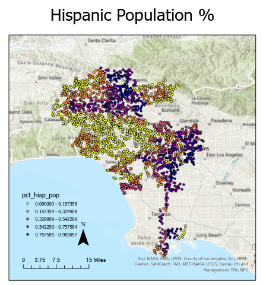

# Investigating Sound Pollution Across Demographics in Los Angeles County

**Summary**

This was a short project I completed as part of my M.S. The goal was to study the spatial characteristics of noise pollution across demographics in LA County using using spatially explicit machine learning methods. In this post Here's an abridged version of our paper and a [link](https://github.com/areeseb/demographicsofsound) to the the analysis we completed using Python/Google Colab.

## Background

There is a growing body of evidence documenting the relationship between noise pollution, and racial segregation and poverty. Minorities, marginalized communities, and low income communities often are subject to higher levels of noise pollution (Casey, et al. 2017, 2021). This is especially troubling due to the recent but fairly wide body of evidence documenting the negative effects of noise pollution on mental and physical health (Chepesiuk, 2005) (Halonen, 2005). Past research in this area has shown that disparities in political power across demographics such as race and income could lead to undesirable land use (e.g. building freeways through poorer neighborhoods rather than affluent ones), causing higher noise pollution. Understanding these relationships could help city planners work towards creating more equitable cities and by limiting noise pollution to bring relief to marginalized communities.

## Introduction

The goal of this project is to perform an exploratory analysis on the relationship between noise pollution and the demographic characteristics in the City of Los Angeles at the census tract level. The focus is specifically on the relationship between noise pollution relating to locally generated noise (excluding traffic, airports, etc.) and the diversity index of that area (from the US Census Bureau).

We will use two primary datasets. The first is an authoritative demographic estimate dataset created by ESRI that includes many variables including, population density, unemployment rate, diversity index, median household income, median home value, and vacant housing units, and population and ethnicity estimates. The other dataset is from HowLoud’s Soundscore™, which provides information on noise pollution for coordinate locations that is compiled from a number of other authoritative sound pollution models.

The primary research question is whether is it possible to predict the variation in the sound pollution with respect to one of the prominent demographic values such as the diversity index. We first investigate correlative relationships using Pearson’s R matrix between the sound values and the other demographic variables. We then develop a generalized multiple linear regression model using _scikit-learn_ to predict local noise values based on the diversity index. Finally we build a geographically weighted multiple linear regression model using _pysal-gwr_ with the same predictor and target variables and compare the results (sound pollution, diversity index, etc). We find that the geographically weighted regression model is significantly better than the regular linear regression due to high spatial autocorrelation in the data. We also find that when space is factored to the model, we can explain to a statistically significant degree the variation in local noise with respect to the diversity index of the location.

## Methods

### Data Description

**HowLoud Soundscores™**
HowLoud, Inc.’s [Soundscore™](https://howloud.com/soundscore) rating is a number between 50 (very loud) and 100 (very quiet) that provides an estimate of how loud a location is due to environmental noise. The Soundscore also provides basic information about the primary sources of sound at a given location, such as traffic noise, airport noise, and local noise. We divide our analysis between each of the subcategories of sound pollution. The data is available through an public API which is free for less than 2500 requests. Because of this limit, we generate a random sample of 2500 locations across the city of LA and query the API based on these locations.

**2018  Los Angeles Demographics**
We use an [ESRI curated polygon layer](https://geohub.lacity.org/datasets/los-angeles-demographics-2018/explore?location=34.029629%2C-118.328799%2C12.90) containing estimates of demographic information  (income, population, diversity, density, growth, etc) for the City of Los Angeles at the census tract level. The estimates are calculated by ESRI scientists from other authoritative data sources such as the American Community Survey and the US Census Bureau. The data includes about 1200 separate polygons but each polygon doesn’t necessarily represent different census tracts. A single census tract can be represented by multiple polygons. Each polygon contains many demographics variables including both raw values, and percentages/rates.  The data is available for free on LA GeoHub in various formats such as CSV, ESRI Shapefile, GeoJSON, or File Geodatabase.

### Data Preparation/Wrangling

The demographic dataset was downloaded from LA GeoHub as a ESRI shapefile and opened in Python as a Geopandas Geodataframe. Inspection of the dataset revealed many very small edge polygons (census tracts) that were likely leftover from when the data was clipped from a larger region (figure 1). This made the tabular data much larger than it needed to be and could cause issues when running spatial intersections. The small polygons were removed by incrementally removing the smallest polygons. This reduced the data from ~1200 polygons (rows), down to 994. The next step was to create a sample of 2500 random point locations across the city. For this we used ArcGIS Pro’s Create Random Points tool. We performed a spatial join on the random points and demographic polygons so that each point location also included the demographic data. We then used the coordinates of each point to query the HowLoud API and acquire the sound pollution values and join them to each point location. Once the final dataframe was created we performed some basic data cleaning and preparation. Total population for each census tract was inconsistent with the population of each sub racial/ethnic demographic so the total was recalculated. Percentage values for each racial/ethnic demographic were calculated. There were also some missing values for the demographic values so they were imputed with the mean values. There were also some (~100) sound values that were missing due to invalid API responses. These point locations were plotted in a map and it was discovered that they were only in locations likely with very quiet sound values (mountains, rural areas). These missing values were imputed with the min sound score of the rest of the data. The final cleaned and prepared dataframe was projected to WGS84 UTM Zone 11N and saved to a GeoJSON format.

### Model Selection & Parameterization

Linear regression models were chosen due to the fairly strong linear correlation in between the target variable (sound values) and predictor variables (demographics). Figure 1 shows linear correlation matrices for all variables and the sound variables independently. Local noise was chosen as the main target variable due to having the highest linear correlation with other demographic variables and due to the fact that traffic noise had high linear correlation with sound score, indicating that it is by far the most prevalent source of noise pollution across the whole city. By looking at local noise, we get a better sense of unique spatial patterns of sound pollution rather than something that is basically ubiquitous across the city (traffic noise).

Target variables were selected based on having the highest correlation with the target variable (local noise). However, many of the variables correlated with local noise, also were strongly correlated with one another. This is known as multi-collinearity and can cause serious problems for multiple linear regression models. To mitigate this, only two predictor variables were chosen: diversity index (divst_indx) and the percentage of the population that identifies as hispanic (pct_hisp_pop). Note that these variables do have multicollinearity. Multiple models were built using a predictor variable (divst_indx) or both (divst_indx, pct_hisp_pop) and every time, the model with both variables performed the best, in terms of R-Squared.

_Figure 1 a. Correlation including all (important) variables  b. Correlation matrix for sound variables_

The first model built was a simple non-spatially explicit general linear regression model. This model was built using scikit-learn in Python. Training and testing data was split 80/20 using random selection. The general linear regression was built mostly for comparison with the subsequent GWR model, knowing that the R-Squared would likely be quite low. 

Figure 2 shows the distributions of the local noise and diversity index values at the random sample points across the city of Los Angeles. Upon visual inspection there appears to be clusters of high and low values in the sound and demographic datasets. This indicates there is some spatial autocorrelation in the datasets. Spatial autocorrelation means that there is a relationship between data points that are close to each other in space. Many statistical techniques assume that data points are independent of one another, however it is clear that the values displayed above have a spatial relationship. The general linear regression model likely performed quite poorly due to this spatial autocorrelation, in which case it would over or under predict string clusters of similar values. 

_Figure 2: a. Distribution of local noise values b. Distribution of diversity index values c. Distribution of hispanic population percentage_

To address spatial autocorrelation in this model, a Geographically Weighted Regression (GWR) was used. PySal’s gwr module in Python was to build the model. This model creates a local regression equation for each data point using the points in its spatial “neighborhood/bandwidth.”  The neighborhood was selected using a nearest neighbors golden search, which chooses the optimal neighborhood size based on the local AICc statistic. This model may result in more accurate results when compared to Generalized Linear Regression (GLR) models due to being able to account for the spatial autocorrelation in the variables.

## Results

The quality of the prediction results are shown in the table below. The GWR model performed significantly better than the GLR model when considering the R-squared value and the residual sum of squares. This implies that the GWR model performs better at predicting the local sound variable for the given demographic variables. The r-squared value of 0.63 is not an overwhelmingly strong predictor but it does suggest some relationship between a location’s demographic characteristics and local sound score.  The map below shows the performance of each point’s equation by calculating the residual sum of squares. A pattern is visible when mapped out that the model performs best when in the clear clusters of high and low diversity index and hispanic population, and worst where the two clusters meet. Due to the relationship between the demographic and sound variables, this is also true of the sound variables, that the algorithm performs worst at the edges. The pattern of spatially differential performance implies that the model is not fully capturing the spatial relationship between points.

|         | GWR   | GLR    |
|---------| ----- | ------ |
|R Squared| 0.63  | 0.20   |
|RSS      | 924.68| 2000.64|

_Figure 3: GWR local equation RSS_

## Discussion/Conclusion

Although the GWR model performed fairly well, the results of this project are limited by the quality of the input data. The demographic data for the City of Los Angeles was only available at a district level. This means that points sampled from the same district had the same demographic values. A more granular dataset of individual households could provide more precise results. The local sound variable was the only dependent variable tried in this project. A weighted combination of the traffic, airport, and local sound variables may have had a stronger correlation with demographic values. Another limitation of this project is that the model should only be considered valid at the scale and study area in which it was executed, and extrapolating out of the range would not be recommended.

Beyond the discussed relationship between local noise and the diversity of a given census tract, there were also a few other prominent variables with a fairly high degree of linear correlation that could be subject to further study. One interesting relationship was that traffic noise had a much higher linear correlation with the aggregate sound score than either of the other two categories (airport noise, local noise). This suggests that the predominant kind of noise pollution in LA is traffic related. So, mitigation efforts might want to focus on traffic to have the highest effect. Another interesting relationship was that median age had a fairly high negative correlation with all the sound variables. This indicates that older populations in LA in general are less subject to noise pollution. It would be interesting to look at sub demographics across age groups to see if this relationship holds true. One final interesting and troubling relationship is that the Black/African American population in LA has a much higher exposure to airport related sound pollution than any other racial/ethnic group. This is likely due to the fact that Inglewood, which has a high percentage of the population that identifies as Black/African American, is directly in line with incoming flights into LAX.

## References

Oshan, T. M., Li, Z., Kang, W., Wolf, L. J., & Fotheringham, A. S. (2019). mgwr: A Python implementation of multiscale geographically weighted regression for investigating process spatial heterogeneity and scale. ISPRS International Journal of Geo-Information, 8(6), 269.

Pedregosa, F., Varoquaux, G., Gramfort, A.,Michel, V., Thirion, B.,Grisel, O., Blondel, M., Prettenhofer, P., Weiss, R.,Dubourg, V., Vanderplas, J., Passos, A., Cournapeau, D., Brucher, M.,Perrot, M., Duchesnay, E. (2011). Scikit-learn: Machine Learning in Python. Journal of Machine Learning Research ,Vol. 12, Page 2825-2830.

 Felcyn, Jan., Anna Preis, Piotr Kokowski, Michał Gałuszka. (2018). A comparison of noise mapping data and people’s assessment of annoyance: How can noise action plans be improved?.Transportation Research Part D: Transport and Environment, Volume 63, 2018, Pages 72-120, ISSN 1361-9209, https://doi.org/10.1016/j.trd.2018.04.019. (https://www.sciencedirect.com/science/article/pii/S1361920917307125)

Chepesiuk R. Decibel hell: the effects of living in a noisy world. Environ Health Perspect.
;113(1):A34-A41. doi:10.1289/ehp.113-a34
Joan A. Casey, Rachel Morello-Frosch, Daniel J. Mennitt,Kurt Fristrup, Elizabeth L. Ogburn,and Peter James. (2017). Race/Ethnicity, Socioeconomic Status, Residential Segregation, and Spatial Variation in Noise Exposure in the Contiguous United States. Environmental Health Perspectives 125:7 CID: 077017 https://doi.org/10.1289/EHP898

Casey, Joan A., Peter James, Rachel Morello-Forsch. (2021). “Urban Noise Pollution Is Worst in Poor and Minority Neighborhoods and Segregated Cities.” The Conversation, https://theconversation.com/urban-noise-pollution-is-worst-in-poor-and-minority-neighborhoods-and-segregated-cities-81888. 
